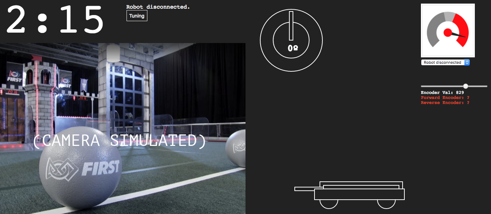

# FRC Dashboard Themes
Several easily configurable themes for your dashboard.

__These themes have been merged into the default install, so this repository is now OBSOLETE.__

## Installation
1. Clone or download this repository.
2. Copy or move the theme you choose into your dashboard directory.
3. In `index.html`, add the following line, substituting "`theme`" for the name of the theme you chose and moved into the directory.

    `<link rel="stylesheet" href="theme/theme.css">`

4. You're done! You are invited to modify the CSS of the theme. If you make a change you think could benefit others, feel free to open a pull request on this repository.

## Examples

